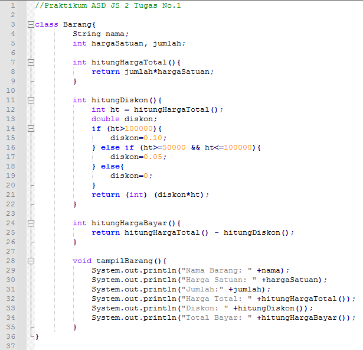

# Laporan Praktikum Pertemuan 2
oleh: Maria Fadilla - 2141720063 (17 / TI-1G)

---
## Jawaban Pertanyaan

### **2.2 Deklarasi Clas, Atribut, dan Method**
> **Percobaan 2.2.1**

--> Tidak, ketika dijalankan terjadi eror.
> **Jawaban Pertanyaan 2.2.3**
1. sebutkan 2 karakteristik class/objek!
+ Class/ objek memiliki sesuatu data / karakter/ atribut
+ Class / objek bisa melakukan suatu tingkah laku / method
2. Kata kunci apakah yang digunakan untuk mendeklarasikan class?
+ mendeklarasikan class menggunakan kata kunc **“class”** yang diikuti dengan nama class-nya. Misal: **class Barang**
3. Perhatikan class Barang yang ada di Praktikum di atas, ada berapa atribut yang dimiliki oleh class tersebut? Sebutkan! Dan pada baris berapa saja deklarasi atribut dilakukan?
- Terdapat 4 atribut, yaitu namaBarang (String), jenisBarang (String), stok (int), dan hargaSatuan (int)
- Deklarasi atribut dilakukan pada baris 13 dan 14
4. Ada berapa method yang dimiliki oleh class tersebut? Sebutkan! Dan pada baris berapa saja deklarasi method dilakukan?
- Terdapat 4 method, yaitu:
1. tampilBarang(): void
2. tambahStok(n: int): void
3. kurangiStok(n: int): void
4. hitungHargaTotal(jumlah: int): int
-  Deklarasi method dilakukan pada baris 16 hingga baris 33
5. Perhatikan method kurangiStok() yang ada di class Barang, modifikasi isi method tersebut sehingga proses pengurangan hanya dilakukan jika stok masih ada (masih lebih besar dari 0)

6. Menurut Anda, mengapa method tambahStok() dibuat dengan memiliki 1 parameter berupa
bilangan int?
- Method tambahStok() memiliki parameter berupa bilangan int, karena nilai data dari method tambahStok() berupa bilangan bulat, input yang dibutuhkan hanya data berupa bilangan pasti atau bulat
7. Menurut Anda, mengapa method hitungHargaTotal() memiliki tipe data int?
- Method hitungHargaTotal() memiliki tipe data int, karena nilai data dari method tersebut berupa bilangan bulat
8. Menurut Anda, mengapa method tambahStok() memiliki tipe data void?
- Method tambahStok() memiliki tipe data void, karena tidak memiliki nilai data kembalian

### **2.3 Instansiasi Objek dan Mengakses Atribut & Method**
> **Percobaan 2.3.1**

> **Jawaban Pertanyaan 2.3.3**
1. Pada class BarangMain, pada baris berapakah proses instansiasi dilakukan? Dan apa nama objek
yang dihasilkan?  
- Instansiasi dilakukan pada baris ke 14, dengan nama objek yang dihasilkan yaitu b1
2. Bagaimana cara mengakses atribut dan method dari suatu objek?
- Cara mengakses atribut dengan cara menuliskan **namaObjek.namaAtribut = nilai;**
    - Pada kode program diatas dituliskan sebagai berikut: 
        > 1. => b1.namaBarang = "Corsair 2 GB";
        > 2. => b1.jenisBarang = "DDR";
        > 3. => b1.hargaSatuan = 250000;
        > 4. => b1.stok = 10;
- Sedangkan untuk mengakses method dengan cara menuliskan **namaObjek.namaMethod();**
    - Pada kode program diatas di tuliskan sebagai berikut 
        > 1. => b1.tambahStok(1);
        > 2. => b1.kurangiStok(3);
        > 3. => b1.tampilBarang();
        > 4. => int hargaTotal = b1.hitungHargaTotal(4);

### **2.4 Membuat Konstruktor**
> **Percobaan 2.4.1**

- modifikasi kode program pada class Barang

- modifikasi kode program pada class BarangMain

> **Hasil Percobaan 2.4.2**
- hasil run program

> **Jawaban Pertanyaan 2.4.3**
1. Perhatikan class Barang yang ada di Praktikum 2.4.1, pada baris berapakah deklarasi 
konstruktor berparameter dilakukan?  
- Deklarasi konstruktor berparameter dilakukan pada baris 25
2. Perhatikan class BarangMain di Praktikum 2.4.1, apa sebenarnya yang dilakukan pada baris 
program dibawah ini?  
**Barang b2 = new Barang("Logitech", "Wireless Mouse", 150000, 25);**
- Baris tersebut melakukan instansiasi konstruktor berparameter dengan nama objek baru yaitu b2
3. Coba buat objek dengan nama b3 dengan menggunakan konstruktor berparameter dari class 
Barang.  
**Barang b3 = new Barang("Photocromic", "Lensa", 5, 120000);**

---
### **2.5 Latihan Praktikum**
> **Jawaban Latihan Praktikum No.1 - Class Barang**
- Kode Program

- Hasil Run Program

> **Jawaban Latihan Praktikum No.2 - Class PacMan**
- Kode Program

- Hasil Run Program

