# Laporan Praktikum Pertemuan 3 - Array Of Object
oleh: Maria Fadilla - 2141720063 (17 / TI-1G)

---
## Jawaban Pertanyaan

### **3.2 Membuat Array dari Object, Mengisi dan Menampilkan**
> **Percobaan 3.2.1**
- Kode Program

    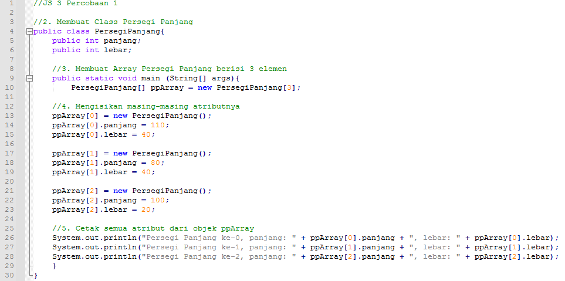

> **Hasil Percobaan 3.2.2**
- Hasil Run Program
    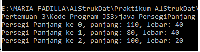

> **Jawaban Pertanyaan 3.2.3**
1. Berdasarkan uji coba 3.2, apakah class yang akan dibuat array of object harus selalu memiliki atribut dan sekaligus method? Jelaskan!
- Berdasarkan kpercobaan 3.2 kita harus memasukkan panjang dan lebar yang dimana itu adalah atribut dari objek tersebut, namun belum terdapat deklarasi method. Menurut saya class yang akan dibuat array of object harus memiliki atribut tetapi tidak harus memiliki method.
2. Apakah class PersegiPanjang memiliki konstruktor? Jika tidak, kenapa dilakukan pemanggilan konstruktur pada baris program berikut :

    **``ppArray[1] = new PersegiPanjang()``**
- Tidak memiliki konstruktor. Kode program tersebut untuk membuat objek PersegiPanjang ke index array 1
3. Apa yang dimaksud dengan kode berikut ini:

    **``PersegiPanjang[] ppArray = new PersegiPanjang[3]``**
- Maksud dari kode tersebut, yakni untuk membuat ppArray yang menampung 3 buah objek PersegiPanjang
4. Apa yang dimaksud dengan kode berikut ini:

    **``ppArray[1] = new PersegiPanjang();``**
	
    **``ppArray[1].panjang = 80;``**

	**``ppArray[1].lebar = 40; ``**
- Kode tersebut untuk instansiasi objek pada array of object atau pembuatan objek persegiPanjang ke index array 1 dan mengisi atribut array index 1 berupa panjang dengan nilai 80 dan lebar dengan nilai 40.
5. Mengapa class main dan juga class PersegiPanjang dipisahkan pada uji coba 3.2?
- Karena agar lebih fleksibel dan menunjukkan class dan objek itu sendiri

### **3.3 Menerima Input Isian Array Menggunakan Looping**
> **Percobaan 3.3.1**

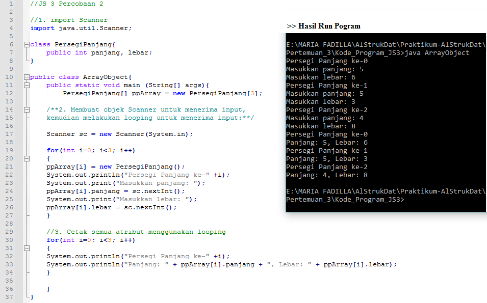

> **Jawaban Pertanyaan 3.3.3**
1. Apakah array of object dapat diimplementasikan pada array 2 Dimensi?
- Iya, bisa
2. Jika jawaban soal no satu iya, berikan contohnya! Jika tidak, jelaskan!
-  Contoh array of object pada array 2 dimensi :
    ``` java
    kucing[][] m = new kucing[1][1];
    k[0][0] = new kucing();
    ``` 
3. Jika diketahui terdapat class Persegi yang memiliki atribut sisi bertipe integer, maka kode dibawah ini akan memunculkan error saat dijalankan. Mengapa?
    ```java
    Persegi pgArray = new Persegi[100]
    pgArray[5].sisi = 20;
    ```
- Kode tersebut akan muncul eror saat dijalankan karena belum dilakukan instansiasi pada array index 5. Seharusnya sebelum pemberian nilai pada sisi, dituliskan kode program berikut :
    ``` java
    pgArray[5] = new Persegi();
    ```  
4. Modifikasi kode program pada praktikum 3.3 agar length array menjadi inputan dengan Scanner!
-  
    ``` java
    System.out.print("Masukkan panjang array : ");
    int arrLength = sc.nextInt();
    PersegiPanjang[] ppArray = new PersegiPanjang[arrLength];
    ```
5. Apakah boleh jika terjadi duplikasi instansiasi array of objek, misalkan saja instansiasi dilakukan pada ppArray[i] sekaligus ppArray[0]? Jelaskan!
- Boleh, saya telah mencobanya dan program dapat dijalankan tanpa kendala. Tetapi program nya jadi kurang efektif.

### **3.4 Operasi Matematika Atribut Object Array**
> **Percobaan 3.4.1**

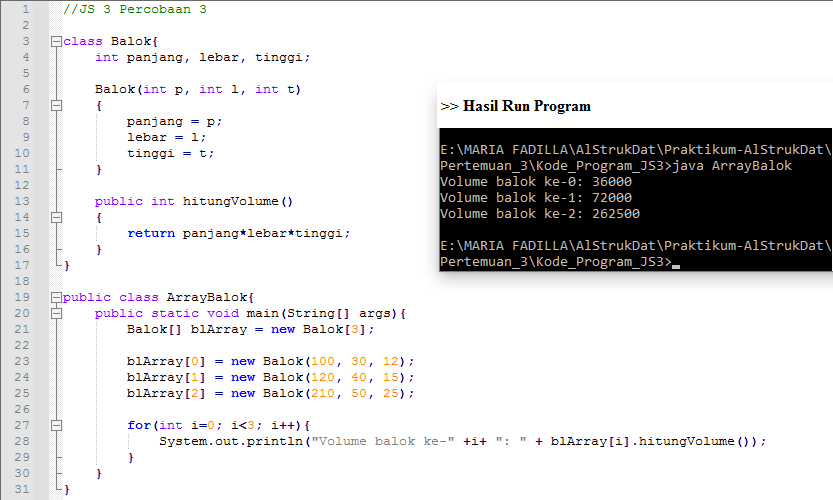

> **Jawaban Pertanyaan 3.4.3**
1. Dapatkah konstruktor berjumlah lebih dalam satu kelas? Jelaskan dengan contoh!
- Dapat, contohnya sebagai berikut konstruktor tanpa dan dengan parameter :
    ``` java
    public class Mahasiswa{
        String nama;
        public Mahasiswa(){

        }
        public Mahasiswa(String a) {
            nama = a;
        }
    }
    ```
2. Jika diketahui terdapat class Segitiga seperti berikut ini:

    **``public class Segitiga {``**

    **``public int alas;``**

    **``public int tinggi;``**

    Tambahkan konstruktor pada class Segitiga tersebut yang berisi parameter int a, int t yang masing-masing digunakan untuk mengisikan atribut alas dan tinggi.
- ``` java
    public class Segitiga{
        public int alas;
        public int tinggi;
        
        //menambahkan parameter
        public Segitiga(int a, int t){
            alas = a;
            tinggi = t;
        }
    }
    ```
3. Tambahkan method hitungLuas() dan hitungKeliling() pada class Segitiga tersebut.
- ```java
    public class Segitiga{
        public int alas;
        public int tinggi;
        
        public Segitiga(int a, int t){
            alas = a;
            tinggi = t;
        }

        //menambahkan method
        int hitungLuas(){
            int luas = (alas*tinggi)/2;
            return luas;
        }
        
        double hitungKeliling(){
            double keliling = Math.sqrt(((alas*0.5)*(alas*0.5))+(tinggi*tinggi))*2+alas;
        }
    }
    ```  
4. Pada fungsi main, buat array Segitiga sgArray yang berisi 4 elemen, isikan masing-masing 
atributnya sebagai berikut:  
sgArray ke-0 alas: 10, tinggi: 4  
sgArray ke-1 alas: 20, tinggi: 10  
sgArray ke-2 alas: 15, tinggi: 6  
sgArray ke-3 alas: 25, tinggi: 10
-   ``` java
    public class SegitigaMain{
        public static void main(String[] args){

            //buat array segitiga berisi 4 elemen
            Segitiga[] sgArray = new Segitiga[4];
                for (int i = 0 ; i < sgArray.length ; i++){
                    sgArray[i] = new Segitiga();
                }

                //mengisikan atribut
                sgArray[0].alas = 10;
                sgArray[0].tinggi = 4;
                sgArray[1].alas = 20;
                sgArray[1].tinggi = 10;
                sgArray[2].alas = 15;
                sgArray[2].tinggi = 6;
                sgArray[3].alas = 25;
                sgArray[3].tinggi = 10;
            }
        }
    ```
5. Kemudian menggunakan looping, cetak luas dan keliling dengan cara memanggil method hitungLuas() dan hitungKeliling().
- ``` java
    public class SegitigaMain{
        public static void main(String[] args){
            Segitiga[] sgArray = new Segitiga[4];
                for (int i = 0 ; i < sgArray.length ; i++){
                    sgArray[i] = new Segitiga();
                }
                sgArray[0].alas = 10;
                sgArray[0].tinggi = 4;
                sgArray[1].alas = 20;
                sgArray[1].tinggi = 10;
                sgArray[2].alas = 15;
                sgArray[2].tinggi = 6;
                sgArray[3].alas = 25;
                sgArray[3].tinggi = 10;

                //cetak luas dan keliling
                for (int i = 0 ; i < sgArray.length ; i++){
                    System.out.println("Luas Segitiga ke - " + (i+1) + " adalah : " + 
                    sgArray[i].hitungLuas());
                    System.out.println("Keliling Segitiga ke - " + (i+1) + " adalah : " + 
                    sgArray[i].hitungKeliling());
                }
        }
    }
---
### **3.5 Latihan Praktikum**
1. Buatlah program yang dapat menghitung luas permukaan dan volume beberapa bangun ruang (minimal 3, jenis bangun luas bebas). Buatlah 3 (tiga) class sesuai dengan jumlah jenis bangun ruang. Dan buat satu main class untuk membuat array of objek yang menginputkan atribut-atribut yang ada menggunakan konstruktor semua bangun ruang tersebut.

    **Keterangan : Buat looping untuk menginputkan masing-masing atributnya, kemudian tampilkan luas permukaan dan volume dari tiap jenis bangun ruang tersebut. 
> Kode Program

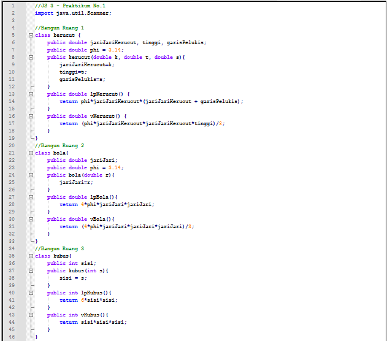
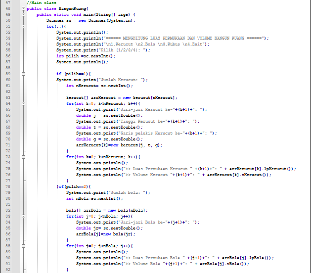
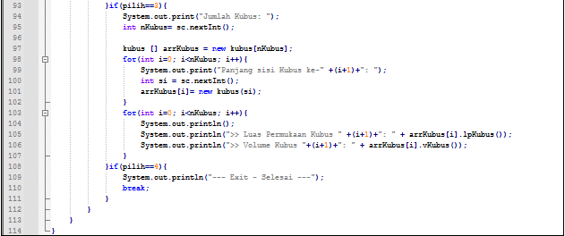

> Hasil Running

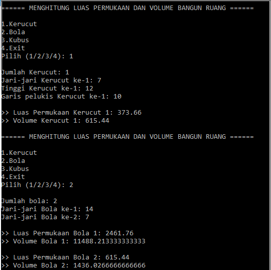
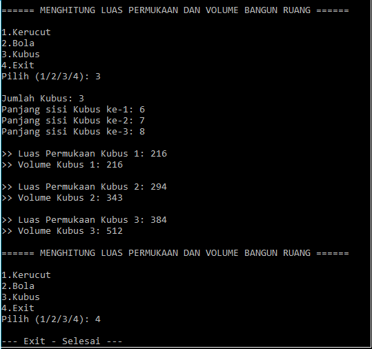

2. Sebuah perusahaan jual beli tanah membutuhkan sebuah program yang dapat memberitahu luas tanah. Program tersebut dapat menerima input jumlah tanah yang akan dihitung dan panjang dan lebar masing-masing dari tanah yang diinputkan. Program dapat menampilkan luas tanah masing-masing tanah yang diinputkan tadi dan juga tanah terluas dari ketiga tanah yang ada.
> **Kode Program**

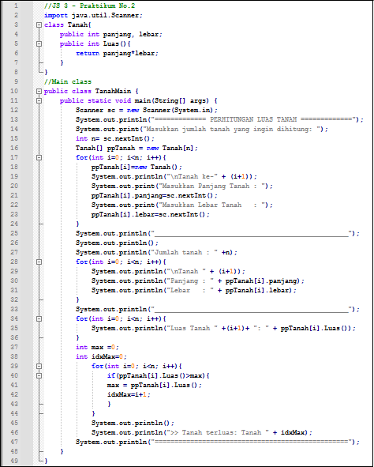

> **Hasil Running**

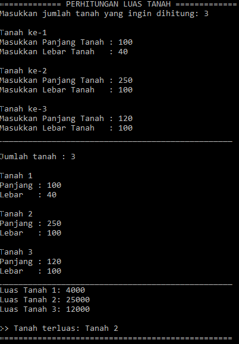

3. Sebuah kampus membutuhkan program untuk menampilkan informasi mahasiswa berupa nama, nim, jenis kelamin dan juga IPK mahasiswa. Program dapat menerima input semua informasi tersebut, kemudian menampilkanya kembali ke user. Implementasikan program tersebut jika dimisalkan terdapat 3 data mahasiswa yang tersedia.
> **Kode Program**

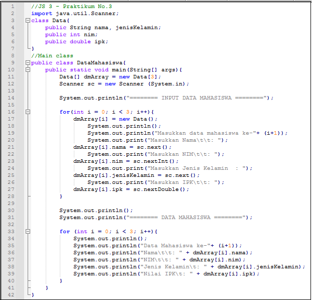

> **Hasil Running**

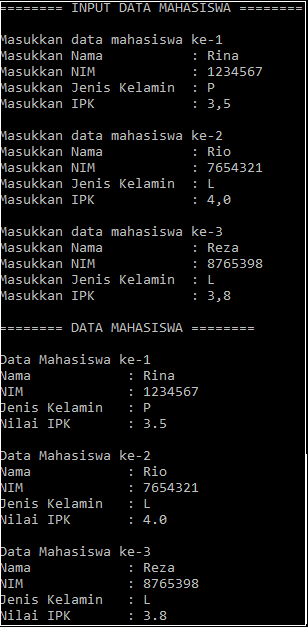