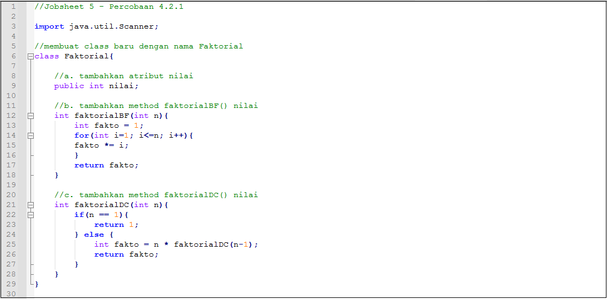
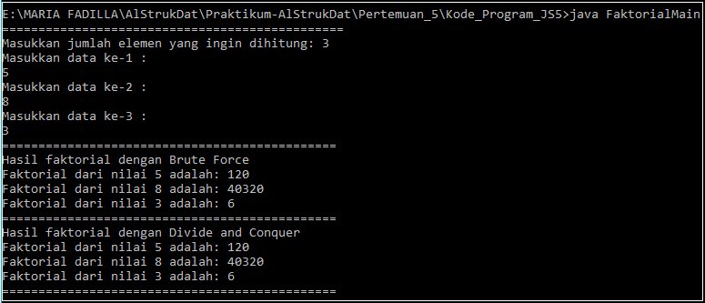
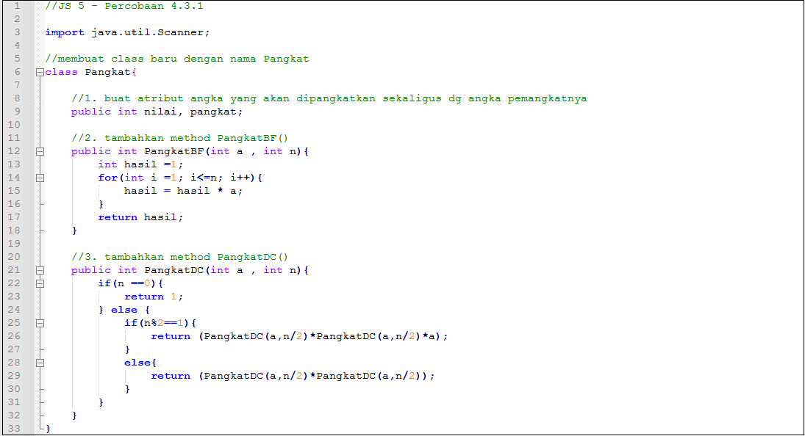
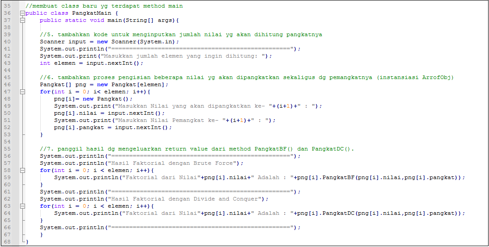
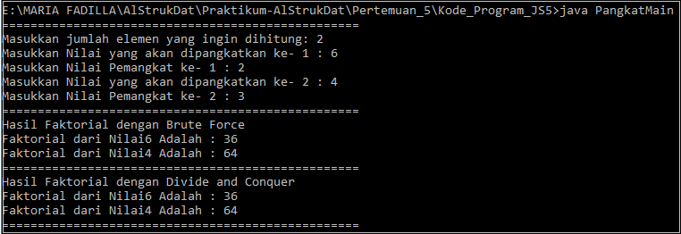
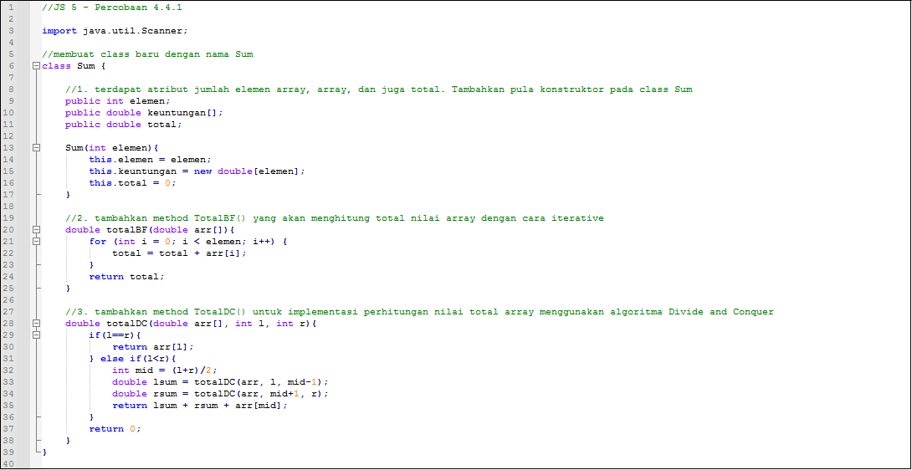
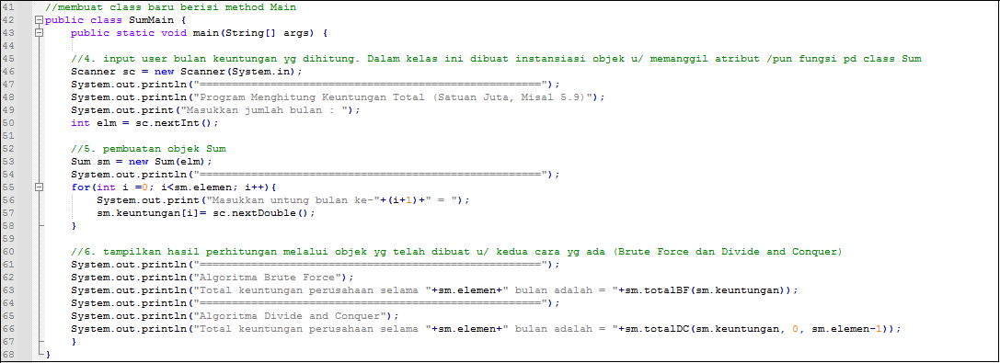
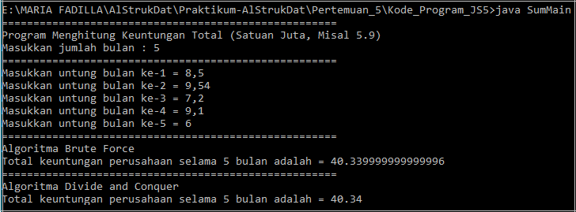

# Laporan Praktikum Pertemuan 5 - Brute Force dan Divide Conquer
oleh: Maria Fadilla - 2141720063 (17 / TI-1G)

---
## Jawaban Pertanyaan

### **4.2 Menghitung Nilai Faktorial dengan Algoritma Brute Force dan Divide and Conquer**
> **Percobaan 4.2.1**
- Kode Program
    
    

> **Hasil Percobaan 4.2.2**
- Hasil Run Program
    

> **Jawaban Pertanyaan 4.2.3**
1. Jelaskan mengenai base line Algoritma Divide Conquer untuk melakukan pencarian nilai faktorial!
- Di dalam class Faktorial dan didalam method Divide Conquer terdapat ``if(n==1)`` lalu di return angka 1 yang artinya jika nilai didalam main ada masukkan nilai 1, maka program akan ditampilkan hingga n bernilai sama dengan 1 sama dengan fungsi iteratif.
2. Pada implementasi Algoritma Divide and Conquer Faktorial apakah lengkap terdiri dari 3 tahapan divide, conquer, combine? Jelaskan masing-masing bagiannya pada kode program!
- **Divide** : Membagi suatu masalah menjadi beberapa upaya dalam masalah yang memiliki kemiripan dengan masalah semula namun berukuran lebih kecil ( idealnya berukuran hampir sama ).
    - Contoh code :
```java 
public int faktorialDC(int n){
    if(n ==1){
        return 1;
    } else {
        int fakto = n * faktorialDC(n-1);
        return fakto;
    }
}
```
- **Conquer** : Memecahkan masing-masing upaya dalam masalah dengan cara rekursif, yaitu dengan mengulang menggunakan sifat pemilihan hingga mencapai nilai yang dicapai oleh program.
    - Contoh code :
```java
public int faktorialDC(int n){
    if(n ==1){
        return 1;
    } else {
        int fakto = n * faktorialDC(n-1);
        return fakto;
    }
}
```
- **Combine** : Menggabungkan solusi masing-masing upaya dalam masalah sehingga membentuk solusi masalah semula.
    - Contoh code:
```java 
return fakto;
```
3. Apakah memungkinkan perulangan pada method faktorialBF() dirubah selain menggunakan for?Buktikan!
- Bisa, misalkan saja menggunakan perualangan while:
```java 
public int faktorialBF1(int n){
    int fakto1 = 1;
    int x =1;
    while(x<n){
        fakto1=fakto1 *x;
        ++ x;
    }
    return fakto1;
}
```
4. Tambahkan pegecekan waktu eksekusi kedua jenis method tersebut!
- 
5. Buktikan dengan inputan elemen yang di atas 20 angka, apakah ada perbedaan waktu eksekusi?
- 

### **4.3 Menghitung Hasil Pangkat dengan Algoritma Brute Force dan Divide and Conquer**
> **Percobaan 4.3.1**
- Kode Program
    
    

> **Hasil Percobaan 4.3.2**
- Hasil Run Program
    

> **Jawaban Pertanyaan 4.3.3**
1. Jelaskan mengenai perbedaan 2 method yang dibuat yaitu PangkatBF() dan PangkatDC()!
- Pada method ``PangkatBF()`` menggunakan perulangan iteratif dimana perulangan akan berhenti hingga batas yang telah ditentukan dan dilakukan secara berurutan,  digunakan untuk mencari hasil hitung pada pangkat dengan menggunakan methode brute force dengan menggunakan perulangan dan pada algoritma brute force nya akan di deklerasikan dahulu dari hasil = 1 hingga menuju nilai batas pada pangkat n. Sehingga bilangan yang akan dipangkat nya akan di looping dengan hasil a kalinya.
- Pada method ``pangkatDC()`` operasi mencari hitung hasil pangkat dilakukan dengan cara divide conquer yang dilakukan dengan rekursif, dimana menciptakan perulangan dengan melakukan pemanggilan terhadap fungsi itu sendiri.
2. Pada method PangkatDC() terdapat potongan program sebagai berikut:
    ```java
    if(n%2==1){ //bilangan ganjil
        return (PangkatDC(a,n/2)*PangkatDC(a,n/2)*a);
    }
    else{ //bilangan genap
        return (PangkatDC(a,n/2)*PangkatDC(a,n/2));
    }
    ```
    Jelaskan arti potongan kode tersebut!
- Jika pangkat pada n dimodulus 2 dan hasilnya adalah sama dengan 1, maka akan direturn hasil dari ``(pangkatDC(a,n/2)*pangkatDC(a,n/2)*a);`` karena bilangan pangkatnya adalah ganjil.
- Jika pangkat pada n dimodulus 2 dan hasilnya adalah bukan sama dengan 1, maka maka return-nya (kembalian nilai) adalah hasil dari ``(pangkatDC(a,n/2)*pangkatDC(a, n/2);`` karena bilangan pangkatnya adalah genap.
- Secara sederhana, jika inputan n merupakan bilangan ganjil, maka n akan dibagi 2 kemudian dikalikan dengan fungsi itu sendiri lalu dikalikan dengan a. Sedangkan jika inputan n adalah bilangan genap, maka n akan dibagi 2 lalu dikalikan dengan fungsi itu sendiri.
3. Apakah tahap combine sudah termasuk dalam kode tersebut? Tunjukkan!
- Sudah, pada kode program sudah terdapat tahap combine yakni sebagai berikut:
    ```java
    return (pangkatDC(a, n/2)*pangkatDC(a,n/2)*a);
    // dan 
    return (pangkatDC(a, n / 2) * pangkatDC(a, n / 2));
    ```
4. Modifikasi kode program tersebut, anggap proses pengisian atribut dilakukan dengan konstruktor.
- 
5. Tambahkan menu agar salah satu method yang terpilih saja yang akan dijalankan!
- Berikut kode programnya:
### **4.4 Menghitung Sum Array dengan Algoritma Brute Force dan Divide and Conquer**
> **Percobaan 4.4.1**
- Kode Program

    
    

> **Hasil Percobaan 4.4.2**
- Hasil Run Program 
    

> **Jawaban Pertanyaan 4.4.3**
1.Berikan ilustrasi perbedaan perhitungan keuntungan dengan method TotalBF() ataupun TotalDC()
- ``TotalBF()``

    Pada totalBF() menggunakan perhitungan yang penjumlahan pada semua elemen termasuk keadalam arr [i], yang dimana akan dihitung kedalam class Sum dan direturn kan menggunakan total = total + arr[i].
- ``TotalDF()``

    Pada TotalDC(); menggunakan perhitungan, jika if(l==r) maka akan dilakukan return pada arr[l]; dan jika else if(l<r) maka akan di return variable lsum + rsum + arr[mid].
- Pada method totalBF() kode terlihat lebih sederhana dan ringkas sehingga lebih mudah dipahami sedangkan pada method totalDC() kode program lebih panjang namun memiliki tingkat efisiensi yang tinggi untuk penyelesaian masalah dengan algoritma yang lebih kompleks.
2. Perhatikan output dari kedua jenis algoritma tersebut bisa jadi memiliki hasil berbeda di belakang koma. Bagaimana membatasi output di belakang koma agar menjadi standar untuk kedua jenis algoritma tersebut.
- Untuk membatasi nilai di belakang koma, bisa menggunakan kode program ``System.out.printf dan %.2f`` seperti berikut:
    ```java
    System.out.printf("Total keuntungan perusahaan selama " + sm.elemen + " bulan adalah = " +"%.2f", sm.totalBF(sm.keuntungan));
    ```
3. Mengapa terdapat formulasi return value berikut? Jelaskan!
    ```java 
    return lsum+rsum+arr[mid];
    ```
- return value pada ``lsum+rsum+arr[mid]`` digunakan untuk mengembalikan nilai atau hasil dari variable lsum, rsum, dan arr[mid] setelah dilakukan penjumlahan pada ketiga variabel tersebut.
4. Kenapa dibutuhkan variable mid pada method TotalDC()?
- Untuk menampung nilai dari perhitungan (l+r)/2 atau setengah nilai dari penjumlahan pada pada variabel l dan r, yang kemudian nantinya akan digunakan sebagai pengisian nilai pada parameter di method totalDC()
5. Program perhitungan keuntungan suatu perusahaan ini hanya untuk satu perusahaan saja. Bagaimana cara menghitung sekaligus keuntungan beberapa bulan untuk beberapa perusahaan. (Setiap perusahaan bisa saja memiliki jumlah bulan berbeda-beda)? Buktikan dengan program!
- Berikut kode program untuk menghitung sekaligus keuntungan beberapa perusahaan dalam beberapa bulan:
    ```java
    import java.util.Scanner;
    class Sum{
        public int elemen[];
        public double keuntungan[];
        public double total;
        public int perusahaan[];

        Array(int elemen, int jmlh_peru){
            this.elemen=new int [elemen];
            this.keuntungan=new double[elemen];
            this.perusahaan=new int[jmlh_peru];
            this.total=0;
        }
        double totalBF(double arr[]){
            for(int i=0; i < elemen.length; i++){
                total =total+arr[i];
            }
            return total;
        }
        double totalDC(double arr[], int l, int r){
            if(l==r){
                return arr[l];
            }else if(l<r){
                int mid =(l+r)/2;
                double lsum = totalDC(arr, l, mid-1);
                double rsum = totalDC(arr, mid+1, r);
                return lsum + rsum +arr[mid];
            }
            return 0;
        }
    }

    public class SumMain{
        public static void main(String[] args) {
        Scanner sc = new Scanner(System.in);
        int e1=0;
        System.out.println("=========================================================");
        System.out.println("Program Menghitung Keuntungan Total (Satuan Juta. Misal 5.9)");
            System.out.print("Masukkan jumlah perusahaan: ");
            int jp= sc.nextInt();
            for(int i=0; i<jp; i++){
                System.out.print("Masukkan jumlah bulan perusahaan ke-" +(i+1)+ " : ");
                int elm= sc.nextInt();
                e1= elm;
            }
            Array sm = new Array(e1,jp);
            System.out.println("=========================================================");
            for(int i=0; i<jp; i++){
                System.out.println("Keuntungan Perusahaan " +(i+1));
                for(int j=0; j<e1; j++){
                    System.out.print("Masukkan keuntungan perusahaan bulan ke -" +(j+1)+" = ");
                    sm.keuntungan[j]= sc.nextDouble();
                }
            }
            for(int i=0; i<jp;i++){
                System.out.println("==========================================================");
                System.out.println("Keuntungan Perusahaan " + (i+1));
                System.out.println("Algoritma Brute Force");
                System.out.printf("Total keuntungan perusahaan ke-" + (i+1) + " adalah = " +sm.totalBF(sm.keuntungan));
                System.out.println("\n==========================================================");
                System.out.println("Algoritma Divide Conquer");
                System.out.println
                ("Total keuntungan perusahaan ke-" + (i+1)  + " adalah = " +sm.totalDC(sm.keuntungan, 0, sm.elemen[i]-1));
            }
        }
    }
    ```
---
### **4.5 Latihan Praktikum**
1. Suatu Perguruan Tinggi di kota Malang sedang mengadakan pemilihan suara untuk memilih ketua BEM tahun 2022. Jika jumlah suara yang terkumpul diumpamakan selalu genap. Maka dengan inputan kandidat terpilih, carilah mayoritas jumlah suara untuk masing-masing kandidat. (Jumlah elemen array dan hasil pemilhan suara merupakan inputan user).

    **Elemen Mayoritas : Elemen mayoritas di dalam A adalah elemen yang terdapat pada lebih dari n/2 posisi. Contohnya, jika n=6 atau n=7 maka nilai mayoritas paling sedikit adalah 4. Berasal dari (7/2)+1 atau (6/2)+1).**

    ``Nilai mayoritas berbeda konsep dengan menghitung total suara terbanyak kandidat terpilih !``
> Kode Program


> Hasil Running


