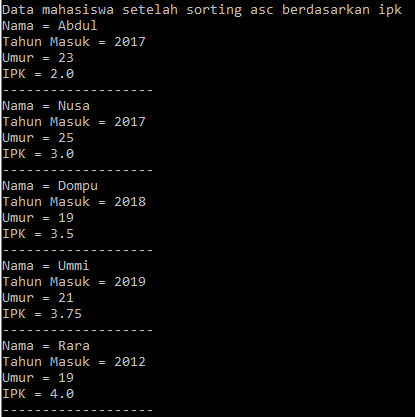

# Laporan Praktikum Pertemuan 6 - Sorting (Bubble, Selection, dan Insertion Sort)
oleh: Maria Fadilla - 2141720063 (17 / TI-1G)

---
## Jawaban Pertanyaan

### **5.2 Mengurutkan Data Mahasiswa Berdasarkan IPK Menggunakan Bubble Sort**
> **Percobaan 5.2.1**
- Kode Program

    
    
    

> **Hasil Percobaan 5.2.2**
- Hasil Run Program

    
    

> **Jawaban Pertanyaan 5.2.3**
1. Terdapat di method apakah proses bubble sort?
- Proses bubble sort terdapat di dalam method bubbleSort() pada class DaftarMahasiswaBerprestasi 
2. Terdapat di method apakah proses selection sort?
- Proses selection sort belum ada dalam method pada class manapun pada Percobaan 5.2.1 di atas, proses tersebut akan ada dalam method selectionSort() pada percobaan selanjutnya.
3. Apakah yang dimaksud proses swap? Tuliskan potongan program untuk melakukan proses swap tersebut!
- Proses `swap` merupakan proses pertukaran tempat atau posisi nilai dari suatu indeks ke indeks yang lain, diurutkan sesuai posisinya dengan cara dibandingkan nilainya secara bertahap dan berulang.
- Potongan program untuk melakukan proses swap, yakni:
    ```java
    Mahasiswa tmp = listMhs[j];
    listMhs[j] = listMhs[j-1];
    listMhs[j-1] = tmp;
    ```
4. Di dalam method bubbleSort(), terdapat baris program seperti di bawah ini:
    ```java
    if(listMhs[j].ipk > listMhs[j-1].ipk){
        //dibawah ini proses swap atau penukaran
        Mahasiswa tmp = listMhs[j];
        listMhs[j] = listMhs[j-1];
        listMhs[j-1] = tmp;
    }
    ```
    Untuk apakah proses tersebut?
- Proses tersebut digunakan untuk melakukan seleksi terhadap nilai IPK berdasarkan besar kecilnya untuk kemudian dilakukan proses swap sehingga nantinya nilai IPK akan terurut.
5. Perhatikan perulangan di dalam bubbleSort() di bawah ini:
    ```java
    for(int i = 0; i < listMhs.length-1; i++){
        for(int j = 1; j < listMhs.length-i; j++){
    ```
    a. Apakah perbedaan antara kegunaan perulangan i dan perulangan j?

    - Peredaannya yakni, perulangan i digunakan untuk menyeleksi baris dari setiap perulangan yang berlangsung saat melakukan proses bubble sort. Sedangkan perulangan j digunakan untuk menyeleksi perulangan pada proses swap, dimana pada proses tersebut setiap kali membandingkan bilangan satu dengan lainnya maka secara otomatis perulangannya akan berkurang satu. 

    b. Mengapa syarat dari perulangan i adalah `i<listMhs.length-1` ?

    - Syarat dari perulangan i adalah `i<listMhs.length-1` karena nilai dari i dimulai dari indeks 0, sehingga untuk memenuhi kondisi dimana jumlah panjang array dari listMhs adalah 5 dan batas perulangan listMhs.length-1 adalah 4. (Rumus perulangan bubble sort `n-1` sehingga perulangan ini akan berulang sesuai dengan jumlah data -1)

    c. Mengapa syarat dari perulangan j adalah `j<listMhs.length-i` ?
    
    - Syarat dari perulangan j adalah `j<listMhs.length-i` karena j sendiri dimulai dari 1 sehingga agar perulangan j tetap sesuai dengan jumlah data, maka listMhs.length dikurang dengan i karena perulangan j juga merupakan bagian dari perulangan i. 
    
    d. Jika banyak data di dalam listMhs adalah 50, maka berapakali perulangan i akan berlangsung? Dan ada berapa Tahap bubble sort yang ditempuh?

    - Jika data di dalam listMhs adalah 50, maka  perulangan i akan berlangsung 50 kali dan bubble sort akan ditempuh dalam 49 tahap.

### **5.3 Mengurutkan Data Mahasiswa Berdasarkan IPK Menggunakan Selection Sort**
> **Percobaan 5.3.1**
- Kode Program

    
    

> **Hasil Percobaan 5.3.2**
- Hasil Run Program

    
    

> **Jawaban Pertanyaan 5.3.3**

Di dalam method selection sort, terdapat baris program seperti di bawah ini:

```java
int idxMin = i;
for(int j = i+1; j < listMhs.length; j++){
    if(listMhs[j].ipk < listMhs[idxMin].ipk){
        idxMin = j;
    }
}
```
Untuk apakah proses tersebut, jelaskan!

- Proses tersebut digunakan untuk melakukan seleksi kondisi dari nilai IPK untuk kemudian dilakukan pengurutan nilai IPK dari terkecil ke terbesar, menggunakan selection sort. Terdapat variabel idxMin sebagai indeks dari kunci pembanding yang merupakan perulangan dari i. Nilai IPK pada tiap indeks akan diseleksi dan `jika nilai ipk dari indeks [j] < ipk indeks [idxMin]` maka `nilai ipk yang lebih kecil tersebut` akan `menjadi nilai dari variabel idxMin`. Proses tersebut terus berulang hingga semua nilai dari ipk yang ada telah diurutkan semua hingga terurut dari ipk terkecil ke terbesar. 


### **5.4 Mengurutkan Data Mahasiswa Berdasarkan IPK Menggunakan Insertion Sort**
> **Percobaan 5.4.1**
- Kode Program

    
    

> **Hasil Percobaan 5.4.2**
- Hasil Run Program 
    
    
    

> **Jawaban Pertanyaan 5.4.3**

Ubahlah fungsi pada InsertionSort sehingga fungsi ini dapat melaksanakan proses sorting dengan cara ascending atau decending, anda dapat melakukannya dengan menambahkan parameter pada pemanggilan fungsi insertionSort.

- Kode Program

    
    

- Hasil Run Program

    
    

### **5.5 Latihan Praktikum**

Sebuah yang bergerak dalam bidang penjualan tiket pesawat sedang mengembangkan back-end untuk sistem pemesanan tiket, salah satu fiturnya adalah menampilkan daftar tiket yang tersedia berdasarkan pilihan filter yang diinginkan user. Daftar tiket ini harus dapat disorting berdasarkan harga dimulai dari harga termurah ke harga tertinggi. Implementasikanlah class diagram berikut ini kedalam bahasa pemrograman java kemudian buatlah proses sorting data untuk harga tiket menggunakan algoritma bubble sort dan selection sort. 

> Kode Program


> Hasil Running


