# Laporan Praktikum Pertemuan 7 - Searching
oleh: Maria Fadilla - 2141720063 (17 / TI-1G)

---
## Latihan dan Jawaban Pertanyaan

### **6.2 Searching/Pencarian Menggunakan Algoritma Sequential Search**
> **Percobaan 6.2.1**
- Kode Program
    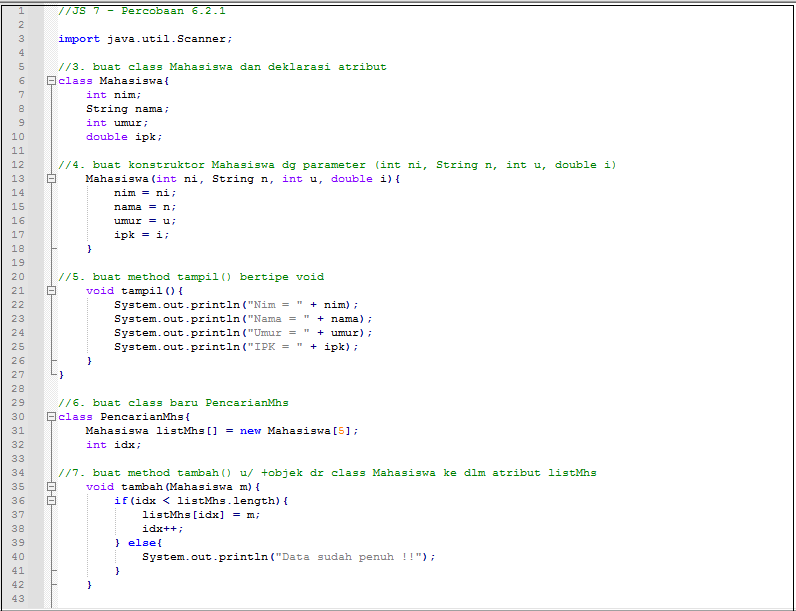
    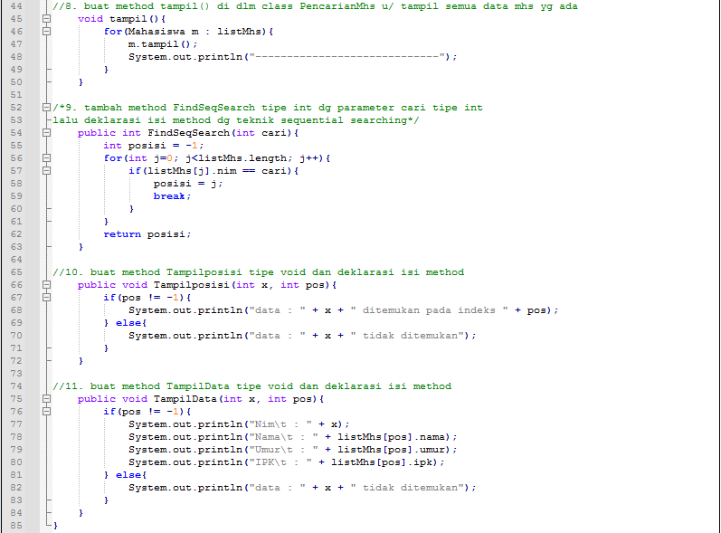
    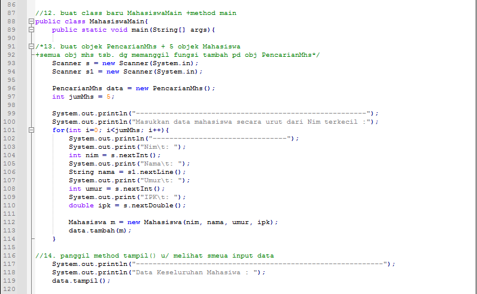
    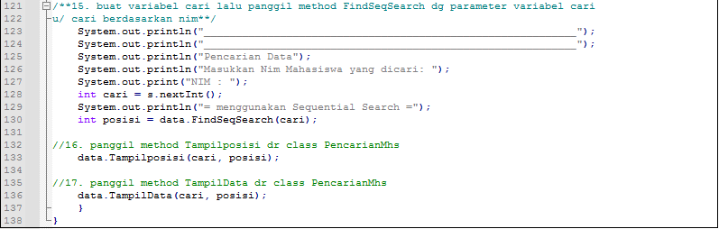

> **Hasil Percobaan 6.2.2**
- Hasil Run Program
    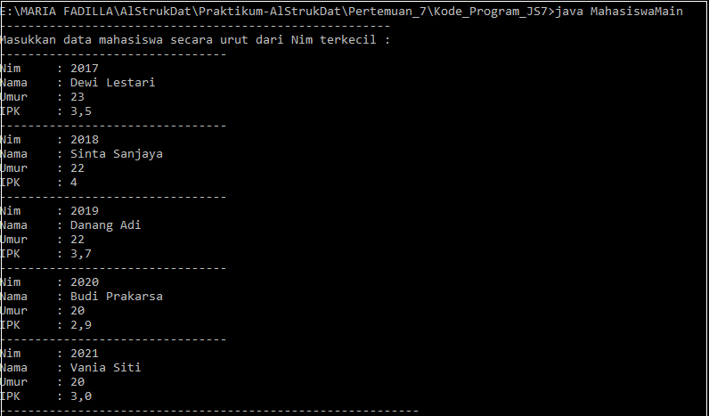
    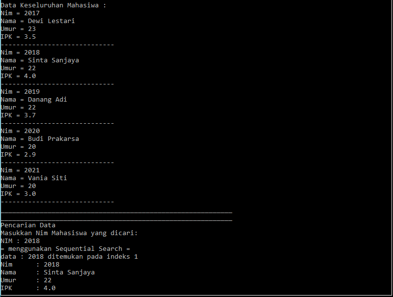

> **Jawaban Pertanyaan 6.2.3**
1. Jelaskan perbedaan metod TampilData dan Tampilposisi pada class PencarianMhs
- Method TampilData digunakan untuk mencetak value dari sebuah objek mahasiswa sedangkan method TampilPosisi digunakan untuk mencetak indeks yaitu pada indeks berapakah objek tersebut berada dalam suatu array of object
2. Jelaskan fungsi break pada kode program dibawah ini! 
    ```java
    if (listMhs[j].nim == cari) {
        posisi = j;
        break;
    }
    ```
- Fungsi break digunakan untuk menghentikan loop pada program. Ketika data nim yang diinput telah sama dengan salah satu data nim pada array, maka loop akan dihentikan.
3. Jika Data Nim yang dimasukkan tidak terurut dari kecil ke besar. Apakah program masih dapat
berjalan? Apakah hasil yang dikeluarkan benar? Mengapa demikian!
- Program masih dapat berjalan dan hasil yang dikeluarkan benar. Hal ini dapat terjadi karena pada sequential search data yang ingin dicari akan dicocokkan dengan masing – masing data pada suatu array secara urut dari indeks awal hingga akhir. Oleh karena itu, pencarian data dengan sequential search tidak membutuhkan suatu kumpulan data yang urut.

### **6.3 Searching/Pencarian Menggunakan Binary Search**
> **Percobaan 6.3.1**
- Kode Program
    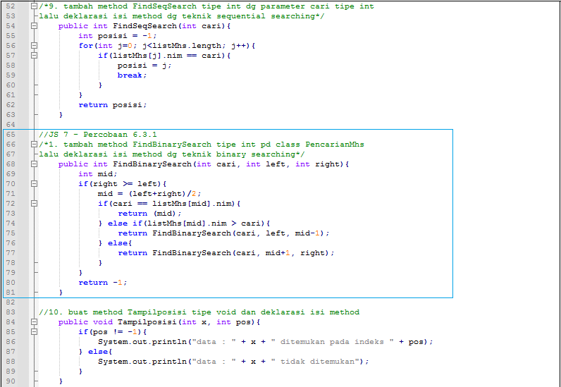
    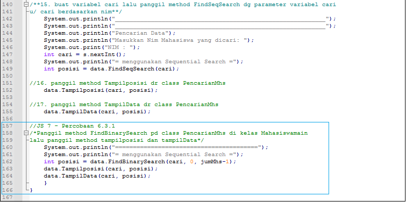

> **Hasil Percobaan 6.3.2**
- Hasil Run Program
    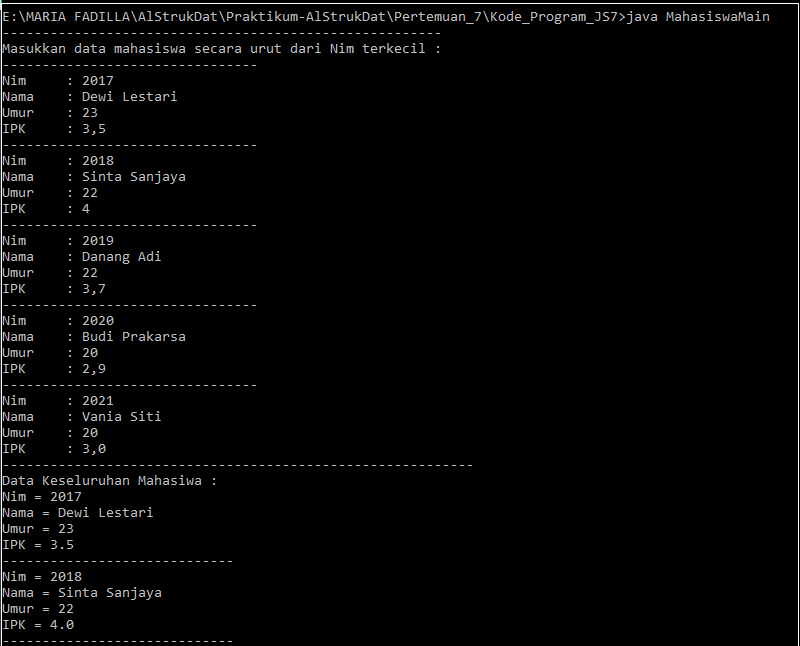
    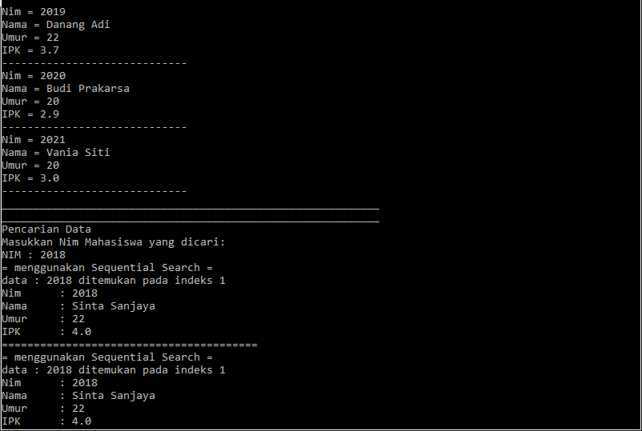

> **Jawaban Pertanyaan 6.3.3**
1. Tunjukkan pada kode program yang mana proses divide dijalankan!
- Berikut:
    ```java
    mid = (left+right)/2;
    ``` 
    **membagi data menjadi 2 bagian untuk menemukan data tengah (mid)
2. Tunjukkan pada kode program yang mana proses conquer dijalankan! 
- Berikut:

    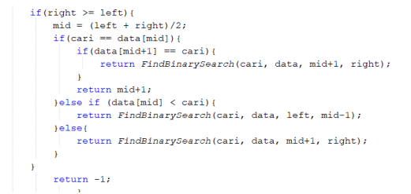
    
    **memecahkan atau menyelesaikan permasalahan
3. Jika data Nim yang dimasukkan tidak urut. Apakah program masih dapat berjalan? Mengapa
demikian!
- Program masih dapat berjalan, namun tidak akan berjalan dengan baik. Hal ini terjadi karena pada binary search ketika sebuah deretan data yang tidak urut dicari nilai tengahnya lalu program ingin menentukan sisi mana yang akan diseleksi kembali berdasarkan perbandingan lebih besar atau lebih kecil antara nilai yang dicari dengan nilai tengah, maka program kemungkinan besar akan mengambil keputusan yang salah dalam mengambil sisi yang benar yang menunjukkan letak nilai yang dicari.
4. Jika Nim yang dimasukkan dari NIM terbesar ke terkecil (misal : 20215, 20214, 20212, 20211,
20210) dan elemen yang dicari adalah 20210. Bagaimana hasil dari binary search? Apakah
sesuai? Jika tidak sesuai maka ubahlah kode program binary seach agar hasilnya sesuai
- Hasil dari binary search belum sesuai, hal ini terjadi karena pada kode program sebelumnya pengurutan data masih dilakukan dari data terkecil ke terbesar. Berikut modifikasi kode program agar hasil binary search sesuai ketika data Nim yang dimasukkan dari NIM terbesar ke terkecil:

    - Sebelum Diubah :
        ```java
        if(cari == listMhs[mid].nim){
            return (mid);
        } else if(listMhs[mid].nim > cari){
            return FindBinarySearch(cari, left, mid-1);
        } else{
            return FindBinarySearch(cari, mid+1, right);
        }
        ```
    - Sesudah Diubah :
         ```java
        if(cari == listMhs[mid].nim){
            return (mid);
        } else if(listMhs[mid].nim < cari){
            return FindBinarySearch(cari, left, mid-1);
        } else{
            return FindBinarySearch(cari, mid+1, right);
        }
        ```
5. Modifikasilah program diatas yang mana jumlah mahasiswa yang di inputkan sesuai dengan
masukan dari keyboard.
- Berikut modifikasi kode program agar jumlah input mahasiswa dapat dimasukkan dari keyboard:
    ```java
    Scanner in = new Scanner(System.in); ???
    ```
### **6.4 Percobaan Pengayaan Divide and Conquer**
> **Percobaan 6.4.1**
- Kode Program
    
    

> **Hasil Percobaan 6.4.2**
- Hasil Run Program
    
    

> **Jawaban Pertanyaan 6.4.3**

### **6.5 Latihan Praktikum**
1.
> Kode Program


> Hasil Running


